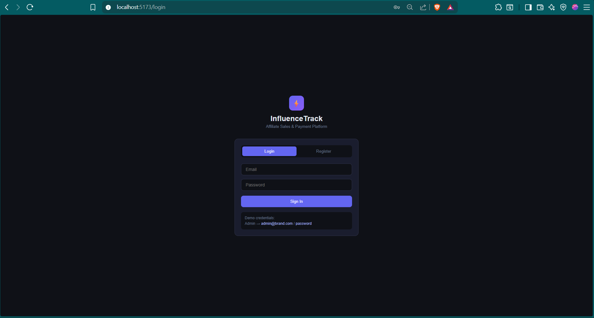
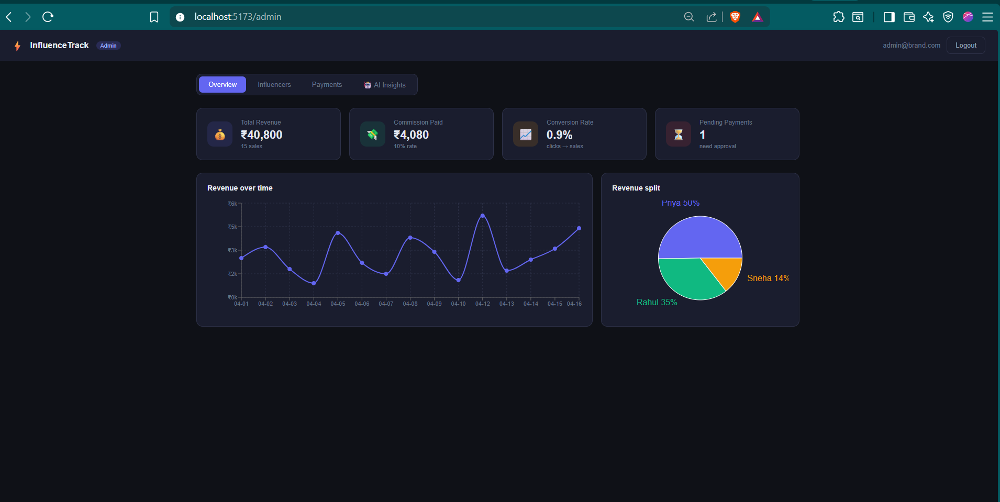
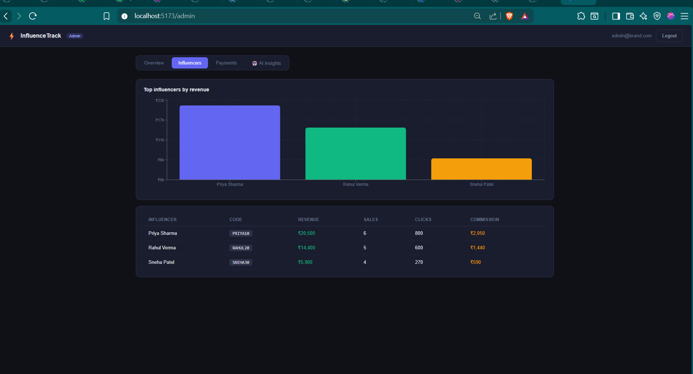

# InfluenceTrack — Influencer Affiliate Sales & Payment Tracking Platform

A full-stack AI-powered web dashboard that tracks influencer-driven sales via an affiliate model, manages commission payments with status workflows, and delivers real-time performance analytics with intelligent AI insights. Built as a complete solution for brands to monitor ROI from influencers in real time.

> **Assignment:** AI Full Stack 

---

## Table of Contents

- [Overview](#overview)
- [Features](#features)
- [Tech Stack](#tech-stack)
- [Project Structure](#project-structure)
- [Getting Started](#getting-started)
  - [Prerequisites](#prerequisites)
  - [Environment Variables](#environment-variables)
  - [Backend Setup](#backend-setup)
  - [Frontend Setup](#frontend-setup)
- [API Documentation](#api-documentation)
- [Database Schema](#database-schema)
- [Screenshots / UI Flow](#screenshots--ui-flow)
- [Demo Credentials](#demo-credentials)
- [Evaluation Criteria](#evaluation-criteria)
- [Deliverables](#deliverables)
- [Bonus Points Checklist](#bonus-points-checklist)
- [Timeline](#timeline)
- [License](#license)

---

## Overview

**InfluenceTrack** is a dual-role platform designed for:

- **Admins (Brands):** Monitor total revenue, track top influencers, manage commission payments, and receive AI-generated growth insights & revenue forecasts.
- **Influencers:** View personal performance metrics, access their unique affiliate link, track sales & clicks, and monitor payment history.

The platform uses a lightweight JSON-based database (LowDB) for rapid prototyping and easy deployment, while leveraging **Google Gemini AI** for intelligent data analysis and 7-day revenue prediction.

---

## Features

### Authentication & Authorization
- Secure JWT-based authentication with bcrypt password hashing
- Role-based access control (`admin` vs `influencer`)
- Persistent login sessions via localStorage

### Admin Dashboard
- **Overview Tab:** Total revenue, commission paid, conversion rate, and pending payments summary with Line & Pie charts
- **Influencers Tab:** Bar chart ranking top influencers by revenue + detailed data table
- **Payments Tab:** Full payment lifecycle management (Pending → Approved → Paid) with bulk generation
- **AI Insights Tab:** 🤖 Smart performance analysis and 7-day revenue forecast powered by Google Gemini

### Influencer Dashboard
- Personal affiliate link with one-click copy
- Key metrics: Total Revenue, Commission Earned (10%), Total Sales, Conversion Rate
- Sales-over-time Line chart
- Recent sales & payment history tables

### Affiliate Tracking
- Unique referral codes auto-generated on influencer registration
- Click tracking endpoint (`/api/influencer/track/:code`) with daily aggregation

### Payment Workflow
- Automatic commission calculation at 10% rate
- Bulk payment generation for unpaid sales
- Status transitions: `pending` → `approved` → `paid`

### AI-Powered Analytics (Assignment Requirements)
> **Must-have:** At least 2 AI-powered features implemented.

- **Option A — Sales Prediction:** Predicts next 7-day revenue using historical sales data, with a confidence score (`low` | `medium` | `high`) and a one-sentence reasoning explanation.
- **Option B — Influencer Performance Insights:** AI-generated actionable insights such as:
  - *"Influencer A performs best on weekends"*
  - *"Low conversion despite high clicks"*
  - Revenue breakdown patterns and click-to-sale efficiency analysis
- Both features are powered by **Google Gemini 2.5 Flash** via a structured JSON prompt pipeline.

---

## Tech Stack

### Backend
| Technology | Purpose |
|------------|---------|
| Node.js + Express | REST API server |
| LowDB | Lightweight JSON file database |
| bcryptjs | Password hashing |
| jsonwebtoken | JWT authentication |
| CORS | Cross-origin resource sharing |
| Google Generative AI | Gemini API for AI insights |
| uuid | Unique ID generation |
| dotenv | Environment variable management |

### Frontend
| Technology | Purpose |
|------------|---------|
| React 19 | UI library |
| Vite | Build tool & dev server |
| React Router DOM | Client-side routing |
| Axios | HTTP client |
| Recharts | Interactive data visualizations |
| CSS3 | Custom dark-themed styling |

---

## Project Structure

```
Assignment 24-04-2026/
├── influencer-backend/          # Node.js + Express API
│   ├── index.js                 # Server entry point
│   ├── db.js                    # LowDB configuration & seed data
│   ├── middleware/
│   │   └── auth.js              # JWT auth & admin-only middleware
│   ├── routes/
│   │   ├── auth.js              # Register / Login
│   │   ├── analytics.js         # Admin dashboard analytics
│   │   ├── influencers.js       # Influencer stats & click tracking
│   │   ├── payments.js          # Payment CRUD & generation
│   │   └── ai.js                # Gemini AI insights
│   ├── package.json
│   └── .env                     # Environment variables (create manually)
│
├── influencer-dashboard/        # React + Vite SPA
│   ├── index.html
│   ├── vite.config.js
│   ├── eslint.config.js
│   ├── src/
│   │   ├── main.jsx             # React DOM entry
│   │   ├── App.jsx              # Router & route guards
│   │   ├── api.js               # Axios instance with auth interceptor
│   │   ├── AuthContext.jsx      # Global auth state (Context API)
│   │   ├── index.css            # Global dark theme styles
│   │   ├── App.css              # Additional component styles
│   │   └── pages/
│   │       ├── LoginPage.jsx    # Login / Register screen
│   │       ├── AdminDashboard.jsx   # Admin analytics & management
│   │       └── InfluencerDashboard.jsx  # Influencer personal dashboard
│   ├── package.json
│   └── public/
│       ├── favicon.svg
│       └── icons.svg
│
└── README.md                    # This file
```

---

## Getting Started

### Prerequisites

- [Node.js](https://nodejs.org/) v18+ installed
- A free [Google AI Studio](https://aistudio.google.com/) API key (for Gemini AI insights)

### Environment Variables

Create a `.env` file inside `influencer-backend/` with the following:

```env
JWT_SECRET=your_super_secret_jwt_key_here
GEMINI_API_KEY=your_google_gemini_api_key_here
PORT=5000
```

> **Note:** `GEMINI_API_KEY` is required for the AI Insights tab to function. The app will still work without it, but AI features will show an error message.

### Backend Setup

```bash
cd influencer-backend
npm install

# Development mode with auto-restart
npm run dev

# OR production mode
npm start
```

Server will run at `http://localhost:5000`

### Frontend Setup

Open a new terminal:

```bash
cd influencer-dashboard
npm install
npm run dev
```

The Vite dev server will start (typically at `http://localhost:5173`)

---

## API Documentation

### Auth Routes (`/api/auth`)
| Method | Endpoint | Description | Auth Required |
|--------|----------|-------------|---------------|
| POST | `/register` | Register new user (auto-creates influencer profile) | No |
| POST | `/login` | Login existing user | No |

### Analytics Routes (`/api/analytics`)
| Method | Endpoint | Description | Auth Required |
|--------|----------|-------------|---------------|
| GET | `/dashboard` | Full admin dashboard data (charts, stats, tables) | Yes (Admin) |

### Influencer Routes (`/api/influencer`)
| Method | Endpoint | Description | Auth Required |
|--------|----------|-------------|---------------|
| GET | `/me` | Get current influencer's stats & history | Yes |
| GET | `/track/:code` | Track an affiliate click | No |

### Payment Routes (`/api/payments`)
| Method | Endpoint | Description | Auth Required |
|--------|----------|-------------|---------------|
| GET | `/` | List all payments with influencer names | Yes (Admin) |
| PUT | `/:id/status` | Update payment status | Yes (Admin) |
| POST | `/generate` | Auto-generate pending payments for all influencers | Yes (Admin) |

### AI Routes (`/api/ai`)
| Method | Endpoint | Description | Auth Required |
|--------|----------|-------------|---------------|
| GET | `/insights` | AI-generated insights + 7-day revenue prediction | Yes (Admin) |

### Health Check
| Method | Endpoint | Description |
|--------|----------|-------------|
| GET | `/api/health` | Returns `{ status: 'ok' }` |

---

## Database Schema

The app uses **LowDB** (a lightweight local JSON database). The `db.json` file is auto-generated on first run with the following default collections:

### `users`
| Field | Type | Description |
|-------|------|-------------|
| id | string | Unique user ID |
| name | string | Full name |
| email | string | Email address |
| password | string | bcrypt-hashed password |
| role | string | `admin` or `influencer` |

### `influencers`
| Field | Type | Description |
|-------|------|-------------|
| id | string | Unique influencer ID |
| userId | string | Linked user ID |
| name | string | Influencer name |
| code | string | Unique affiliate referral code |
| email | string | Email address |

### `sales`
| Field | Type | Description |
|-------|------|-------------|
| id | string | Sale ID |
| influencerId | string | Associated influencer |
| amount | number | Sale amount in ₹ |
| date | string | ISO date (YYYY-MM-DD) |
| product | string | Product name |

### `payments`
| Field | Type | Description |
|-------|------|-------------|
| id | string | Payment ID |
| influencerId | string | Associated influencer |
| amount | number | Payment amount |
| status | string | `pending`, `approved`, or `paid` |
| date | string | ISO date |

### `clicks`
| Field | Type | Description |
|-------|------|-------------|
| id | string | Click record ID |
| influencerId | string | Associated influencer |
| date | string | ISO date |
| count | number | Click count for that day |

---

## Screenshots / UI Flow

1. **Login / Register Page** — Dark-themed auth screen with role selection and demo credentials hint
### Login / Register Page

2. **Admin Dashboard** — 4-tab interface with:
   - Revenue line charts & pie charts
   - Influencer leaderboards
   - Payment management table
   - AI insights panel with forecast cards
### Admin Dashboard Overview
   
3. **Influencer Dashboard** — Personal stats cards, affiliate link copier, sales chart, recent sales & payment tables
### Influencer Performance

### Payment Management

### AI Insights & Predictions


---

## Demo Credentials

Use these credentials to test the admin dashboard immediately:

| Role | Email | Password |
|------|-------|----------|
| Admin | `admin@brand.com` | `password` |

You can also register new influencer accounts from the login page.

---

## Evaluation Criteria

This project is designed to meet the following evaluation rubric:

| Area | How It's Addressed |
|------|-------------------|
| **Functionality** | End-to-end affiliate tracking, sales recording, commission calculation, and payment status workflow (Pending → Approved → Paid) fully implemented |
| **UI/UX** | Clean, intuitive dark-themed dashboards with interactive Recharts visualizations, responsive layout, and clear data hierarchy |
| **AI Implementation** | Real value delivered via Gemini-powered **Sales Prediction** (Option A) and **Performance Insights** (Option B) — not a gimmick |
| **Code Quality** | Modular route structure, middleware separation, reusable React components, clear naming conventions, and scalable architecture |
| **Product Thinking** | Real-world usability: affiliate codes, click tracking, commission automation, payment lifecycle, and AI forecasting for brand ROI monitoring |

### Thank you!